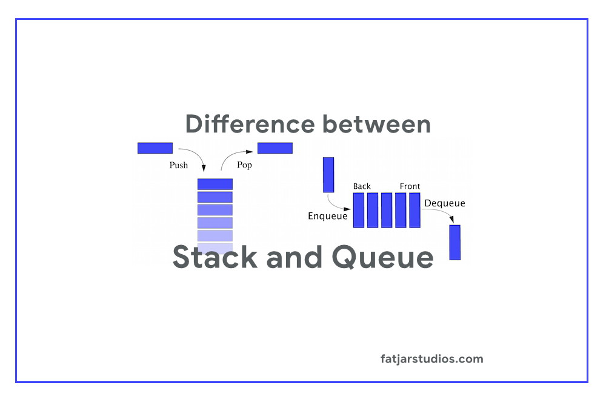

# Stacks and Queues
## What is a Stack!

Stacks and queues are fundamental data structures in computer science that are used to store and manipulate collections of elements. They are both linear data structures, meaning that the elements are arranged in a sequence and accessed sequentially.

## Stack

A stack is an ordered collection of elements where the insertion and removal of items follow a Last-In-First-Out (LIFO) order. The last element inserted is the first one to be removed. It can be visualized as a stack of plates where you can only add or remove plates from the top.

### Operations on a stack:

- **Push:** Adds an element to the top of the stack.
- **Pop:** Removes and returns the top element from the stack.
- **Peek or Top:** Returns the top element without removing it.
- **IsEmpty:** Checks if the stack is empty.
- **Size:** Returns the number of elements in the stack.

Stacks are commonly used for tasks that involve tracking function calls, evaluating expressions, implementing undo/redo functionality, and parsing algorithms like depth-first search (DFS).

## Queue

A queue is an ordered collection of elements where the insertion happens at one end called the rear, and removal occurs at the other end called the front. This ordering follows a First-In-First-Out (FIFO) principle. Think of it as a line of people waiting for a bus, where the first person to arrive is the first one to board the bus.

### Operations on a queue:

- **Enqueue:** Adds an element to the rear of the queue.
- **Dequeue:** Removes and returns the front element from the queue.
- **Front:** Returns the front element without removing it.
- **Rear:** Returns the rear element without removing it.
- **IsEmpty:** Checks if the queue is empty.
- **Size:** Returns the number of elements in the queue.  

Queues are commonly used in scenarios like scheduling processes, handling requests in web servers, breadth-first search (BFS) algorithms, and simulations.

Both stacks and queues can be implemented using various underlying data structures such as arrays, linked lists, or even dynamic arrays.

It's important to choose the appropriate data structure based on the requirements of your specific problem, as each has its strengths and limitations.
