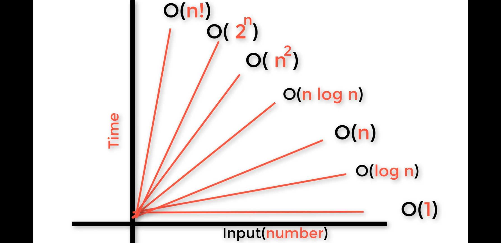
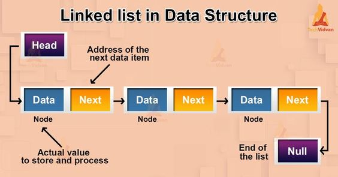

# Big O: Analysis of Algorithm Efficiency

## Big O(oh) notation is used to describe the efficiency of an algorithm or function. This efficiency is evaluated based on 2 factors

1. Running Time (also known as time efficiency / complexity)
The amount of time a function needs to complete.
2. Memory Space (also known as space efficiency / complexity)
The amount of memory resources a function uses to store data and instructions.

## Overview

Big O’s role in algorithm efficiency is to describe `the Worst Case` of efficiency an algorithm can have in performing it’s job. It specifically looks at the factors mentioned above, which we often refer to as **Space** and **Time**. In order to analyze these limiting factors, we should consider **4 Key Areas** for analysis:

1. Input Size.
2. Units of Measurement
3. Orders of Growth
4. Best Case, Worst Case,and Average Case,(lower bound,upper bound,tight bound )

- Best Case .. Omega Notation 
- Average Case .. theta notation
- **Worst Case .. Big O notation, where O refer to Order**

## Input Size

 Often denoted as "n" represents the measure of the size or scale of the input data that an algorithm operates on. It typically quantifies the input in terms of the number of elements or the total amount of information that needs to be processed.
The relationship between the input size and the algorithm's resource requirements is essential for analyzing its efficiency and scalability. By analyzing how the running time and memory usage grow with respect to the input size, we can make informed decisions about algorithm selection and optimization strategies.

- **Big O**: The worst case analysis of algorithm efficiency.
- **Running Time**: The amount of time required for an algorithm to complete.
- **Memory Space**: The amount of memory resources required for an algorithm to complete.
- **Input Size**: Represented by the variable n, the total size of values used as parameters in an algorithm.
- **Big Omega**: The best case analysis of algorithm efficiency.
- **Big Theta**: The typical or random case used for analysis of algorithm efficiency.  

# What is a Linked List

A Linked List is a sequence of Nodes that are connected/linked to each other. The most defining feature of a Linked List is that each Node references the next Node in the link. 
There are two types of Linked List 
- Singly Linked List
- Doubly Linked List 

1. Linked List - A data structure that contains nodes that links/points to the next node in the list.

2. Singly refers to the number of references the node has. A Singly linked list means that there is only one reference, and the reference points to the Next node in a linked list.
3. Doubly refers to there being two (double) references within the node. A Doubly linked list means that there is a reference to both the Next and Previous node.
4. Nodes are the individual items/links that live in a linked list. 
- Each node contains the data for each link.

5. Next - Each node contains a property called Next. This property contains the reference to the next node.
6. Head - The Head is a reference of type Node to the first node in a linked list.
7.  The Current is a reference of type Node to the node that is currently being looked at.

# Linear data structures

Linear data structures are data structures in which data elements are stored in a linear sequence. 

1. **Arrays**: A collection of elements stored in contiguous memory locations.
2. **Linked Lists**: A collection of nodes, each containing an element and a reference to the next node.
3. **Stacks**: A collection of elements with Last-In-First-Out (LIFO) order.
4. **A tree data structure** is a hierarchical structure that is used to represent and organize data in a way that is easy to navigate and search.
4. **Queues**: A collection of elements with First-In-First-Out (FIFO) order.
5. **Linear data structures** :are used in many computer science applications such as searching, sorting, and manipulating data.   
