# SQL (Structured Query Language)

 SQL has a variety of commands for working with relational databases, including `SELECT, INSERT, UPDATE,` and `DELETE`. These commands can be combined to perform complex operations on large datasets.

 SQL also includes a number of functions for performing calculations and manipulating data. Some common functions include COUNT, SUM, AVG, and MAX/MIN.

So the relational databases and SQL are fundamental tools for managing and analyzing data in a wide range of industries and applications. 

## _____________________________________________________________

## SQL Queries lessons

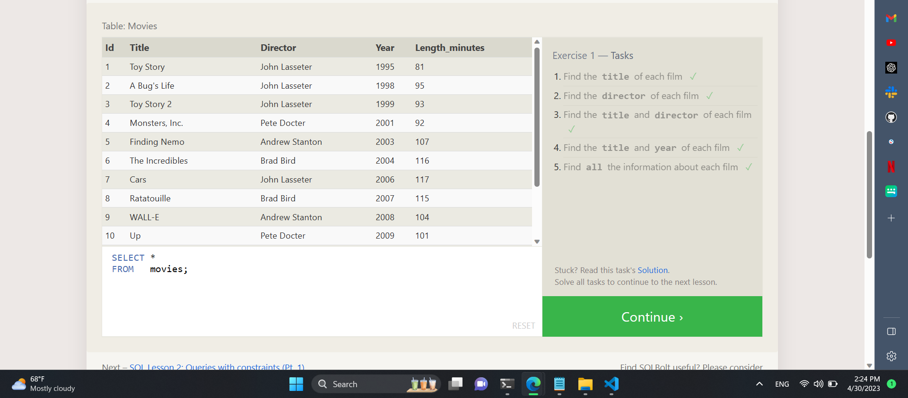
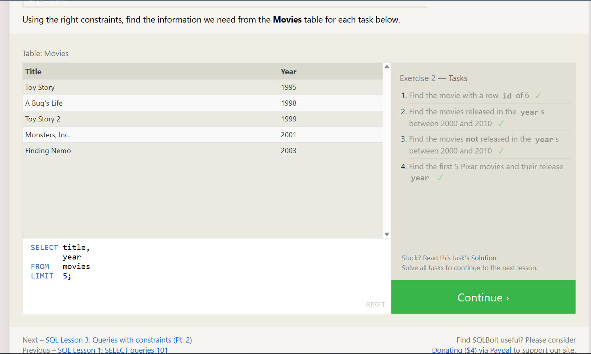
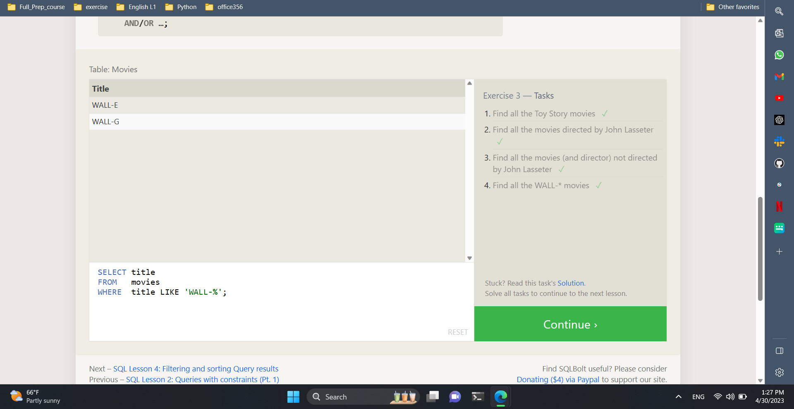
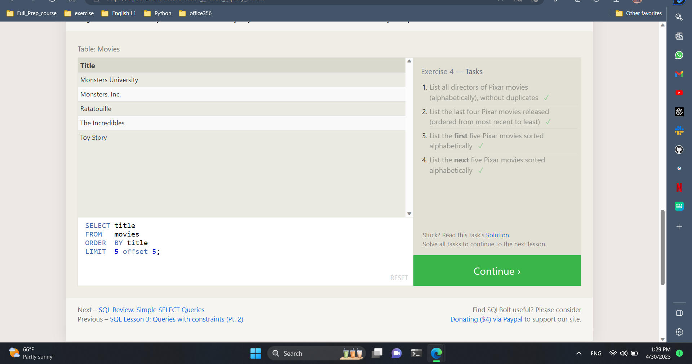
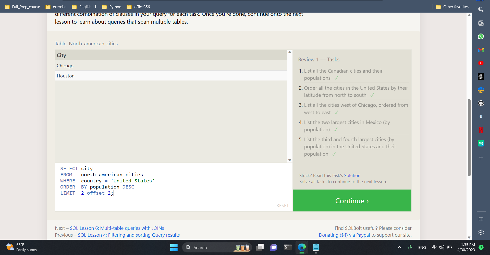
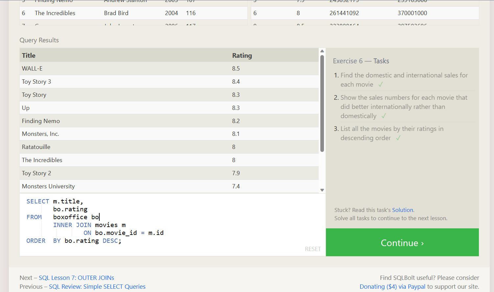

## _____________________________________________________________

##  Database Management

 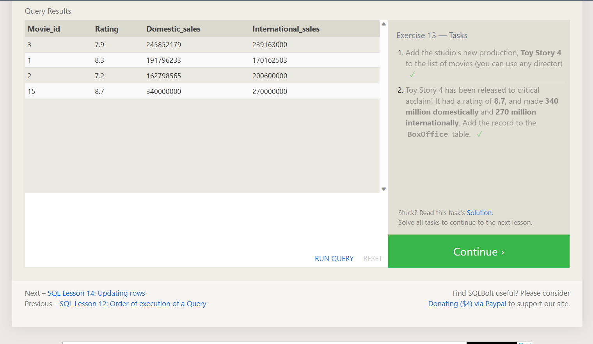
 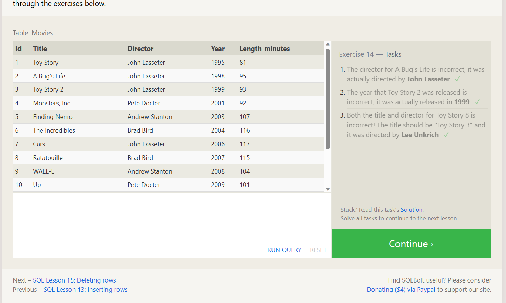
 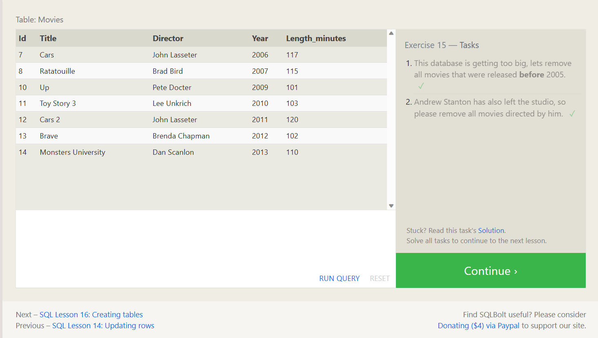
 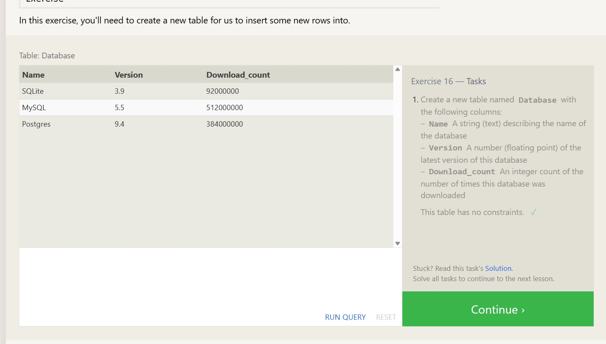
 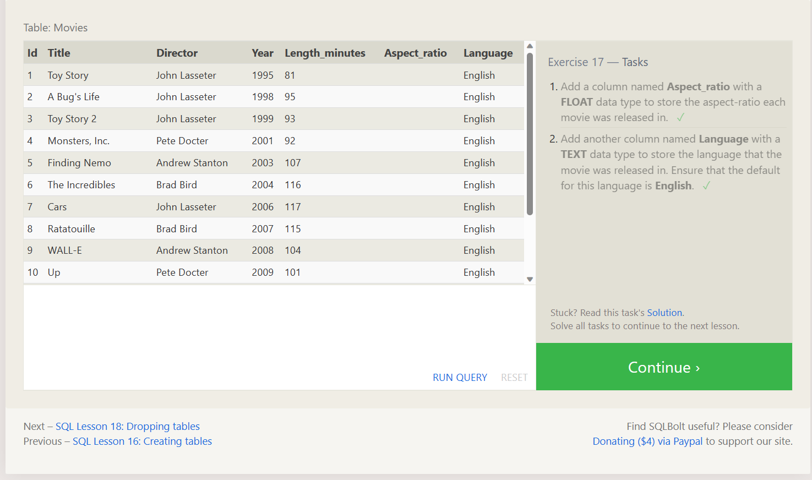
 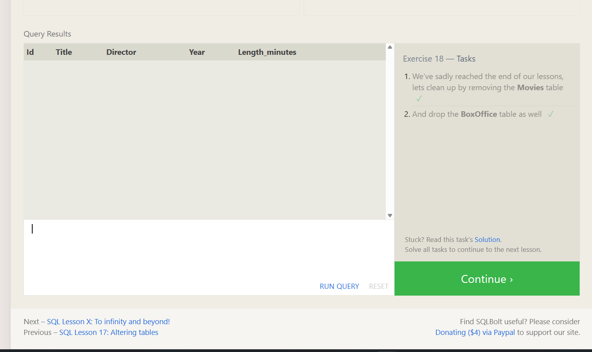

  
`Resources`

1. <https://www.w3schools.com/sql/>
2. <https://www.udacity.com/course/sql-for-data-analysis--ud198>
3. <https://sqlbolt.com/lesson/select_queries_introduction>