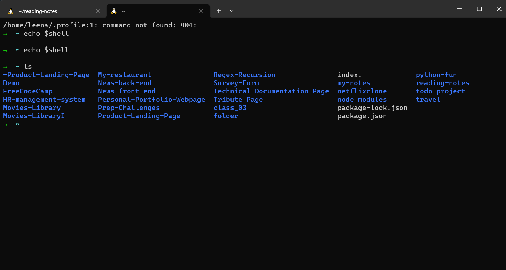
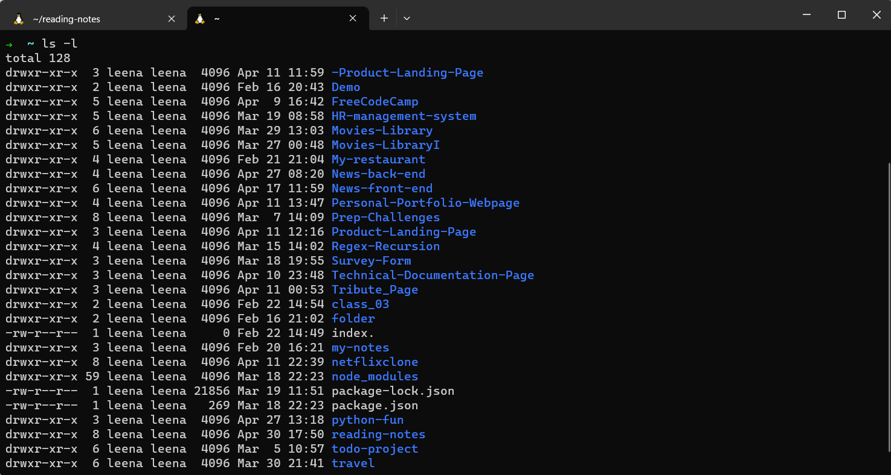
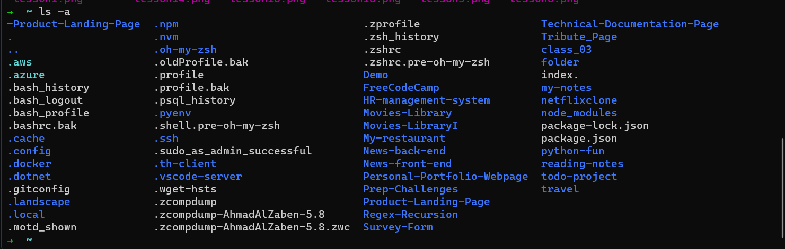
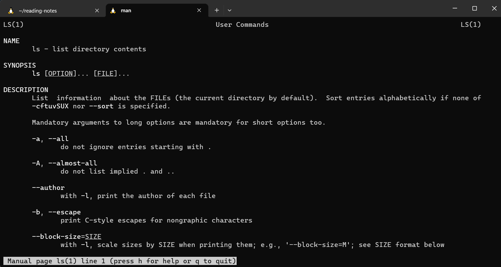

## 1.The command line

 What is it?

Also known as the command-line interface (CLI), is a text-based interface used to interact with a computer's operating system.

The user interacts with the computer by typing commands into a terminal or console, by using a graphical user interface (GUI) with icons and menus.

## 2. Basic Navigation

 The commands are:

1.   `pwd ` , stands for "print working directory" and is used to display the current directory or folder that the user is working in. It is a useful command for navigating and managing files in the command line, as it helps the user keep track of their current location within the file system.

2. `ls `, It's short for list

3. `ls -l`, the command displays the file or directory name, permissions, owner, group, size, and modification date and time.

4.  `ls /etc`, The output lists the files and directories in the /etc directory in alphabetical order. Each file or directory name is displayed on a separate line.

###  Path, [ Absolute and Relative Paths]

An absolute path refers to the complete path of a file or directory from the root directory of the file system. It begins with a drive letter (e.g., C:) on Windows.

A relative path, on the other hand, specifies the location of a file or directory relative to the current working directory. It does not include the entire path from the root directory (e.g., ../Desktop/example.txt).

### More on Paths

1. `~ (tilde)` - This is a shortcut for your home directory.
2. `. (dot) `- This is a reference to your current directory.
3. `.. (dotdot)`- This is a reference to the parent directory.

### path command

cd [location] :stand for change directory.

## 3. More about File

 #### The most common extensions:

1. file.exe : excutable file
2. file.txt : text file type
3. file.png , file.jpg , file.gif : image type   

### Hidden file and directory   

## 4. Manual Pages

### A set of pages that explain every command available on your system including what they do.

1. man <command to look up> : show details for the command. 

2. man -k <search term> if we want to search within the manuals.
3. /<term>Within a manual page, perform a search for 'term'.
4. n After performing a search within a manual page, select the next found item.

## 5. Files Manipulation

### Making a Directory 

1. mkdir [options] <Directory> make new directory in your current location.

- mkdir -p: To make parent directories as needed.
- mkdir -v: To show us what mkdir command doing.

2. rmdir [options] <Directory> remove the current directory.

- rmdir -p: To remove parent directory as needed.
- mkdir -v: To show us what rmdir command doing.

3. Create file using command.

- touch <'file name'>

4. Copy file or directory

- cp [options] <source> <destination>

5. Move file or directory

- mv [options] <source> <destination>

6. Remove files by using.

- rm [options] <file>
- rm -r : r stand for recursive : we can remove non empty file.

## 6. Cheat Sheet
This cheat sheet is intended to be a quick reference guide for commonly used commands, syntax, and concepts in a particular area or topic. Cheat sheets are often used by programmers, system administrators, and other technical professionals to save time and improve productivity by providing a concise summary of important information.
