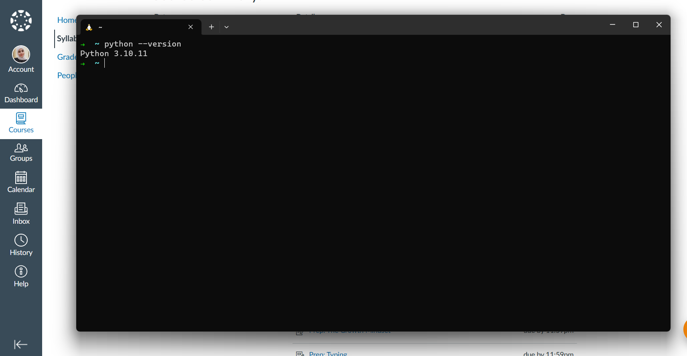

## Features of Python that I like

1. Python's syntax is Clean and Readability. 

2. No need to declaring a variable and can be changed on the fly without having to declare their type beforehand.

3. Easy to learn: Python's syntax is designed to be easy to learn, which makes it a great language for beginners.

## Features of Python that I dislike: 

1. python is sensitive to White space and accept lower dash only, which make it harder to catch errors at compile time, which can lead to more bugs at runtime.

2. Slow Runtime Speed: Python is an interpreted language, which means that it can be slower than compiled languages like C or Java.

## Python is similar to JavaScript: 

1. Popular for web development: both languages are commonly used for web development, Python being used for server-side web applications and JavaScript being used for client-side web development.
2. Both languages use dynamic typing, which means that the type of a variable is determined at runtime. 
3. Both languages support common data structures, such as arrays, dictionaries, and lists.

## Python is different from JavaScript:

1. Python has a simpler syntax than JavaScript.
2. Python has better readability than JavaScript. 
3. Python has better memory management than JavaScript.
4. JavaScript can be used to run on the frontend, whereas python is on server-side programming or backend.    

`The installation for py is complete`   
